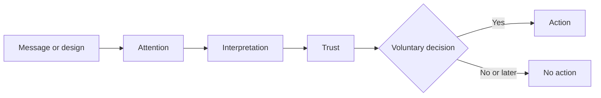

# Chapter 1: Persuasion Is About More Than Getting a Yes

Persuasion is the craft of helping someone notice something, make sense of it, decide whether to trust it, and choose what to do next. It appears in an election speech, a campus safety poster, a product page, a friend asking you to try a restaurant, and the label on a plain white T-shirt.

That last example matters. A white T-shirt is just cotton, stitching, a size, and a color. Yet it can be presented as a durable workwear staple, a minimalist wardrobe essential, a soft undershirt, a sustainably made basic, or a blank canvas for self-expression. The physical shirt has not changed. Its *meaning* and the attention paid to different features have.

Good persuasion does not treat people as buttons to press. It gives them useful reasons, reduces confusion, and makes a worthwhile action easier to take. It also accepts that people retain the right to say no.

## What persuasion shapes

Persuasion usually works through four connected jobs:

1. **Attention:** What will a person notice in a crowded environment?
2. **Interpretation:** What will that thing seem to mean?
3. **Trust:** Why should the person believe the claim or source?
4. **Action:** What, if anything, should they do now?

Imagine three signs beside the same white T-shirt:

- “WHITE T-SHIRT — $18” directs attention mostly to price.
- “One soft, dependable layer for early studio mornings” frames the shirt as comfort and routine.
- “Made with traceable cotton; repair guide included” frames it as a more accountable purchase.

Each sign invites a different interpretation. None is automatically dishonest; the ethical question is whether its claims are true, relevant, and presented fairly.

## Persuasion, coercion, and manipulation

These terms are often blurred together, but the differences are important.

| Approach | How it works | Is a meaningful choice preserved? | White T-shirt example |
| --- | --- | --- | --- |
| Persuasion | Offers clear, truthful reasons and an understandable next step | Yes | “This heavyweight shirt keeps its shape after repeated washes; feel the fabric before deciding.” |
| Coercion | Uses force, threats, or penalties to compel compliance | Little or no | “Buy this shirt or lose access to the event.” |
| Manipulation | Steers a choice by hiding material facts, exploiting vulnerability, or creating a false impression | Formally perhaps, but not fairly | Showing “only 1 left” when stock is plentiful, or hiding that the shirt shrinks significantly. |

Persuasion can be energetic, emotional, and commercially motivated without becoming coercion or manipulation. A strong color, a moving story, or a limited-time sale is not inherently wrong. The line is crossed when pressure or deception substitutes for informed choice.

## Cialdini’s principles of influence

Psychologist Robert Cialdini synthesized several recurring patterns in how people respond to influence. They are not magic spells; they are tendencies that work differently depending on context, evidence, and the audience. Cialdini first popularized six principles and later added **unity** as a seventh.

| Principle | Basic idea | Responsible T-shirt application |
| --- | --- | --- |
| Reciprocity | People often want to return a genuine benefit they received. | Offer a useful fabric-care card or fitting help, without making it feel like a debt. |
| Commitment and consistency | People tend to act in ways that fit prior choices, values, and stated commitments. | Let shoppers save a “build a simpler wardrobe” list; recommend the shirt only if it fits that stated goal. |
| Social proof | In uncertainty, people look to what comparable others do or approve of. | Show verified reviews from people who mention height, fit, and use case—not invented testimonials. |
| Liking | We are more open to people and groups we like or identify with. | Use a friendly, credible student ambassador who actually wears and can discuss the shirt. |
| Authority | Relevant expertise can make information more credible. | Have a textile specialist explain fabric weight and care, while showing their qualifications and limits. |
| Scarcity | Limited availability can make an option feel more valuable or urgent. | State a real deadline for a small production run; do not manufacture a fake countdown. |
| Unity | Shared identity and belonging can increase cooperation and trust. | Frame a campus-club shirt as something designed *with* club members, not as a way to shame outsiders. |

Notice the recurring word: *real*. Social proof must be genuine, authority must be relevant, and scarcity must be true. These principles explain common human shortcuts; they do not give designers permission to exploit them.

## Two more lenses that make persuasion clearer

### 1. Framing: the meaning around the facts

Framing is the way a communicator selects and emphasizes aspects of a situation. A frame does not need to change the object. It changes which features become mentally prominent.

The same white T-shirt might be framed as:

- **Value:** “Two shirts, many outfits.”
- **Durability:** “Heavyweight cotton for repeated wear.”
- **Identity:** “A clean base for your own style.”
- **Environmental care:** “Made to be worn often, not discarded after one season.”

Framing is useful because no message can say everything at once. Ethical framing leaves out details only when they are not material to the decision. If the “durable” shirt is uncomfortable, expensive to care for, or made with an unverified environmental claim, those facts should not be buried.

### 2. Cognitive ease and choice architecture

People have limited time and attention. When a choice is easy to understand, compare, and complete, they are more likely to act. Behavioral economics calls the arrangement of options a **choice architecture**.

A confusing shirt page might list ten nearly identical white shirts with vague names and no fit information. A clearer page could group them by a real decision: “lightweight,” “everyday,” and “heavyweight,” then show price, fabric weight, fit, care, and return policy in the same place. This does not force a buyer to choose. It reduces needless friction.

Designers should be especially cautious with defaults. Preselecting “add a second shirt” may increase sales, but it can also turn inattention into an unwanted purchase. A helpful default is easy to see, easy to change, and plausibly beneficial to the user—not merely profitable to the seller.

### 3. Rhetoric: reasons, credibility, and feeling

Classical rhetoric offers another practical lens:

- **Logos** is the case made with reasons and evidence: “This fabric weighs 220 gsm and retained its shape after our stated wash test.”
- **Ethos** is credibility: a company that explains its materials, limitations, and return process can earn more trust than one that makes grand claims.
- **Pathos** is emotion: a photograph of friends customizing white shirts before a campus event can make belonging feel vivid.

The most persuasive message often combines all three. But pathos should not overwhelm logos, and ethos should not be faked with a lab coat, a vague “expert approved” badge, or selective evidence.

## A practical way to design a persuasive message

Start with the audience’s situation, not the feature list. A first-year student rushing between classes may care about a shirt that layers easily and survives laundry; an illustrator may care about a smooth surface for screen printing. Then make a specific, supportable claim and show what action is available.

For example:

> “One white tee for long studio days: heavyweight cotton, a relaxed fit, and care instructions that help it last. Check your size before adding it to your cart.”

This message frames the product for a use case, offers reasons, and keeps the choice visible. It would become less ethical if it claimed durability without evidence or made the sizing information hard to find.

## Ethical cautions

Before publishing, test persuasion against a few hard questions:

- Do the words, images, counts, testimonials, and urgency claims accurately represent reality?
- Could a reasonable person miss a cost, consequence, limitation, or alternative that matters?
- Are we targeting people in a moment of unusual vulnerability, such as financial distress or fear?
- Is declining as easy as accepting? Can people unsubscribe, return, or change a default without a maze?
- Would we be comfortable explaining the design choice to the people affected by it?

Short-term conversion is not the only measure of success. Deceptive persuasion can produce a click or sale while damaging trust, creating regret, and harming people who had less power or information. Design quality includes the quality of the relationship it creates.

## Questions a designer should ask before trying to persuade someone

1. Who is this for, and what are they actually trying to accomplish?
2. What attention are we asking for, and why is it worth giving?
3. Which claim is central, and what evidence supports it?
4. How might different people interpret this message?
5. Which influence principle, frame, or emotional cue are we using—and is it truthful?
6. What important limitation, cost, or trade-off should be visible?
7. Does the person have a clear, low-pressure way to decline or decide later?
8. What outcome would count as good for the audience, not only for our organization?

## Explore Further

Rather than relying on a single summary, search for and compare primary work, later critiques, and real examples. Useful searches include:

- `Robert Cialdini Influence reciprocity commitment social proof authority scarcity liking unity`
- `choice architecture defaults behavioral economics ethical design`
- `framing effect psychology communication examples`
- `dark patterns consumer choice design research`
- `ethos logos pathos rhetoric contemporary design`

## What You Should Remember

Persuasion shapes attention, interpretation, trust, and action while preserving a person’s meaningful ability to choose. Cialdini’s principles, framing, choice architecture, and rhetoric can make communication more effective, but none excuses false claims or hidden pressure. A plain white T-shirt can carry many honest meanings; responsible design makes its framing useful, evidence-based, and fair.
