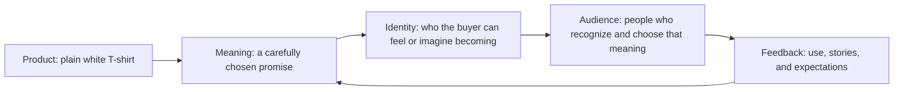

# Chapter 2: Brand Archetypes and the Meanings People Choose

Products do not arrive in people’s minds as a list of specifications. They arrive with a feeling, a story, and an implied answer to a quiet question: *What kind of person might I be if I choose this?*

Brand archetypes are a practical framework for answering that question. They are generalized cultural and narrative patterns—recognizable roles such as the Explorer, the Caregiver, or the Rebel. A designer can use them to give a product, organization, or experience a more coherent meaning.

Consider the plain white T-shirt from the previous chapter. Physically, it is still a white shirt: cotton, seams, sleeves, a fit, and a price. But it might be presented as gear for an adventurous life, a crisp essential for someone building confidence, or a blank surface for an artist. The product remains the same. The promise about identity changes.

The most useful practical question is:

> **What does the audience get to feel, imagine, or become by choosing this brand?**

That question shifts archetypes away from decorative mood boards and toward an audience-centered design decision.

## From product to identity

A product supplies practical value: the shirt covers the body and can be comfortable, washable, and durable. A brand connects that value to meaning. Over time, the meaning can help an audience express or try on an identity.

This is a loop, not a one-way broadcast. A brand can propose meaning, but audiences decide whether it feels believable. They also reshape it through their own use, conversations, reviews, and communities.

## A working set of common archetypes

There is no single official list that every designer must follow. The following set is common in branding conversations because each pattern suggests a different emotional promise. Treat these as starting points, not scientific diagnoses.

| Archetype | Core desire or promise | What the audience may get to feel, imagine, or become | White T-shirt direction |
| --- | --- | --- | --- |
| Explorer | Freedom and discovery | Independent, open to possibility, ready to go | A tough, packable shirt for unplanned days outdoors or in a new city |
| Sage | Understanding and truth | Informed, clear-eyed, capable of good judgment | A plainly explained shirt: fabric, fit, care, and trade-offs made easy to compare |
| Creator | Expression and invention | Original, capable, ready to make | A clean white base meant for drawing, printing, dyeing, or customizing |
| Ruler | Order, mastery, and responsibility | Composed, discerning, in control | A precisely fitted, impeccably presented wardrobe staple |
| Caregiver | Care, safety, and support | Considered, reliable, able to help others | A soft, easy-care shirt positioned for comfort and dependable everyday use |
| Rebel | Liberation and disruption | Defiant, unfiltered, unwilling to follow the script | A deliberately plain tee paired with a message about making your own rules |
| Hero | Courage and achievement | Strong, disciplined, ready for a challenge | A hard-wearing training or work shirt that emphasizes effort and resilience |
| Everyperson | Belonging and everyday realism | Included, comfortable, part of the group | A straightforward, accessible staple for ordinary lives and shared routines |
| Innocent | Simplicity, optimism, and safety | Refreshed, hopeful, free from complication | A bright, uncomplicated shirt presented as a clean start to the day |
| Jester | Fun and living in the moment | Playful, relaxed, welcome to experiment | A white tee marketed as the canvas for a silly doodle or an impromptu costume |
| Lover | Connection, beauty, and sensory pleasure | Attractive, intimate, attentive to detail | A soft, well-cut shirt that focuses on touch, confidence, and personal style |
| Magician | Transformation and possibility | Changed, inspired, able to see new potential | A shirt that becomes something new through a dye, print, or styling transformation |

The goal is not to force every brand into one row. The table helps a team decide which human promise should guide choices such as voice, photography, packaging, service, and product features.

## The same shirt, three very different stories

Here are three dramatically different positions for the identical plain white T-shirt.

### Explorer: “Leave room for the unplanned”

The shirt is folded next to a transit map, a water bottle, and a worn notebook. The language emphasizes mobility, repeat wear, and being ready for a day that changes course. The audience gets to imagine themselves as self-directed and curious.

The design consequence is not simply adding a mountain photo. It is making the promise credible: show the fit in motion, explain how to pack or care for it, and avoid pretending a normal shirt is technical equipment if it is not.

### Creator: “Start with a blank surface”

The shirt is shown with fabric markers, screen-print tools, and student sketches. The language invites experimentation: make a one-of-one garment, test a color, or turn an idea into something wearable. The audience gets to feel capable of making rather than merely consuming.

The product is identical, but its blankness now has a purpose. A useful supporting detail might be honest information about which inks, dyes, or transfer methods work on the fabric.

### Ruler: “The essential, refined”

The shirt appears in a quiet, ordered wardrobe with restrained type and close views of the collar and seams. The language emphasizes proportion, consistency, and a dependable uniform. The audience gets to imagine a more composed version of themselves—someone whose basic choices are already handled.

The risk is overclaiming. Precise visual design cannot turn a poorly made shirt into a luxury item. If “refined” is the position, fit, construction, service, and price should support it.

The same shirt could also lean Caregiver by promising ease and comfort, Jester by inviting playful customization, or Hero by connecting it honestly to demanding daily work. The archetype is the organizing story, not a costume pasted onto the product.

## Using archetypes in real design work

An archetype is most helpful when it produces decisions. If a team says, “We are the Sage,” ask what changes:

- Will product information become clearer and more specific?
- Will the visual system favor legibility over mystery?
- Will customer support explain trade-offs instead of pushing every option?
- Will social posts teach something useful rather than merely sound intelligent?

Likewise, a Caregiver brand should make care visible in its policies and accessibility, not only in warm photography. A Rebel brand should be wary of rebellious language that serves a conventional, opaque business practice. Meaning is credible when the experience repeatedly delivers it.

## Archetypes Are Not Destiny

Archetypes describe patterns in stories and culture; they are not rigid categories of human personality. A person can want discovery on a weekend, reassurance during a difficult semester, and a little playfulness at a party. A brand can also contain multiple tendencies.

For example, a design school might be primarily Creator-led because it invites students to make things. It may also use Sage qualities when it teaches research and Caregiver qualities when it supports students through challenges. The question is not “Which one is the only true archetype?” It is “Which promise leads here, and which supporting promises make it believable?”

Cultural context matters as well. Symbols, humor, ideas of authority, and stories of success do not mean the same thing everywhere. A Ruler-style message that signals confidence in one setting may seem stiff or exclusionary in another. An Explorer message may assume money, safety, mobility, or leisure that an audience does not have. Research with the people affected by a design; do not assume a universal reading from a familiar archetype label.

Avoid turning archetypes into stereotypes. They should expand the ways people can recognize themselves, not reduce audiences to gender, age, class, nationality, or a simplistic psychological type.

## A small decision process

Start with the actual audience and product, then use an archetype to focus the promise.

1. Describe what the product genuinely does and does not do.
2. Learn what the audience needs, values, fears, and hopes in this situation.
3. Choose a leading meaning: for example, freedom, mastery, care, belonging, or expression.
4. Select one primary archetype and, if useful, one supporting tendency.
5. Translate that choice into evidence, language, visuals, interaction, and service.
6. Test whether people understand the intended meaning and whether it feels credible and welcoming.

For the white T-shirt, “Creator with a touch of Jester” might lead to a simple, colorful customization guide. “Everyperson with Caregiver support” might lead to inclusive fit information, straightforward pricing, and an easy exchange policy. The labels only matter because they direct better choices.

## Questions to Ask When Choosing an Archetype

1. What does this product or experience actually offer beyond its features?
2. What does the audience get to feel, imagine, or become by choosing it?
3. Which archetype best clarifies that promise without making claims the product cannot support?
4. What second tendency might add needed nuance—for example, Creator plus Sage, or Hero plus Caregiver?
5. How will this choice appear in the product, service, voice, images, and policies—not just in a tagline?
6. Which cultural assumptions are built into this archetype, and have we checked them with the relevant audience?
7. Could this framing exclude, stereotype, pressure, or mislead someone?
8. If the archetype disappeared from the presentation, would the actual experience still make the promise believable?

## What You Should Remember

Brand archetypes are flexible cultural patterns that help a product carry recognizable meaning. They are not fixed personality types, and no person or brand has to fit only one. Begin with what the audience can feel, imagine, or become; choose an archetype that the real product and experience can honestly support; and let cultural context and audience research challenge your assumptions. Even a plain white T-shirt can mean exploration, creative possibility, quiet mastery, or something else entirely.
