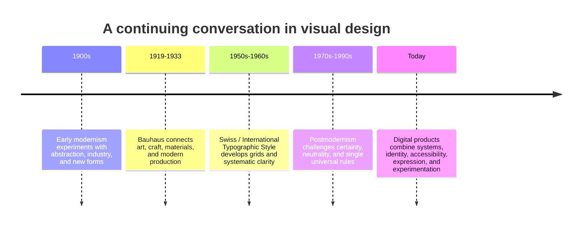

# Chapter 3: Design Language Carries Ideas

Visual design is not a neutral wrapper placed around information after the important work is done. Type, spacing, color, images, materials, and interaction tell people what to notice, how seriously to take it, and what kind of world it belongs to. Together, these repeated choices form a **design language**.

You do not need to know a style’s name to read its effects. A rigid grid, a large amount of empty space, and a sans-serif typeface may make a page feel controlled and clear. Layered type, bright clashes of color, and unexpected decoration may make it feel loud, personal, playful, or unstable. Neither set of choices is automatically better. Each carries ideas about order, audiences, culture, and expression.

This chapter offers a short history—not as a parade of labels to memorize, but as a way to notice a continuing argument inside design.

## A short historical narrative

### Early modernism: design for a changed world

In the late nineteenth and early twentieth centuries, industrial production, urban growth, new technologies, and mass media changed everyday life. Many artists and designers looked for forms that felt suited to this new world. Early modernism was not one unified movement, but it often valued experimentation, abstraction, new materials, and a break from historical ornament.

Some designers believed visual form could be made more direct and rational. Others used bold geometry, dynamic composition, or simplified forms to express speed and social change. The shared impulse was often to ask whether inherited styles still made sense in an industrial, modern society.

### Bauhaus: integration of art, craft, and industry

The Bauhaus was a German school active from 1919 to 1933. Its teaching and work changed over time, but it is often associated with bringing art, craft, design, and industrial production into conversation. Workshops explored materials and making; teachers and students also developed influential approaches to typography, furniture, architecture, and visual form.

The popular slogan “form follows function” is too simple to describe everything connected with the Bauhaus. Still, functional purpose, material honesty, geometry, economy of form, and design for modern production became powerful ideas around it. A Bauhaus-informed visual language might use simple shapes and purposeful construction—not because decoration is forbidden, but because every choice is expected to earn its place.

### Swiss / International Typographic Style: clarity through systems

After the Second World War, designers associated with Swiss typography and the International Typographic Style developed highly systematic approaches to communication. The style is commonly linked to grid-based layouts, asymmetric composition, sans-serif type, objective photography, clear hierarchy, and careful use of space.

Its appeal was practical as well as aesthetic. A grid could organize complex information. Consistent type and alignment could help a message travel across languages and institutions. The style aimed for clarity and order, sometimes with an aspiration toward universality: the idea that visual communication could be legible and useful beyond a narrow local style.

That aspiration brought real strengths. It also raises a question: who gets to define what “neutral,” “universal,” or “clear” looks like?

### Postmodernism: questioning the rules and the claims behind them

Postmodernism is also not a single look. It describes several related reactions in art, architecture, graphic design, and culture. In design, postmodern work often questioned modernism’s confidence in certainty, restraint, universality, order, and the idea that one clean visual system could solve communication for everyone.

Postmodern designers might quote earlier styles, mix high and popular culture, use irony, embrace ornament, interrupt a grid, or make a message visibly subjective. The point was not simply to make layouts messy. It was to question who benefits when a particular style is treated as neutral, timeless, or inevitable.

This reaction could make design more expressive and culturally specific. It could also make information harder to use if disruption becomes an end in itself. That is why the historical argument is still useful: it gives you choices and responsibilities, not a winning team.

## The tensions that continue

Modernism and postmodernism are not two buttons on a style picker. They name tendencies that continue to interact in contemporary work.

| Tension | One pull | The other pull | Contemporary design question |
| --- | --- | --- | --- |
| Order and disruption | Predictable hierarchy and repeatable rules | Surprise, interruption, and visual energy | Should an event site calm a complex schedule, or create a sense of discovery? |
| Universality and identity | Broad legibility and shared conventions | Local voice, subculture, and specificity | Can an app use familiar controls while still sounding like its community? |
| Clarity and expression | Fast comprehension and low ambiguity | Mood, personality, and emotional texture | Does a healthcare screen need quiet clarity, while a music campaign earns more expressive range? |
| Grid and anti-grid | Alignment, rhythm, and scalable systems | Overlap, irregularity, and deliberate rule-breaking | Which information must line up, and where can a layout break expectation? |
| Restraint and abundance | Fewer elements and disciplined emphasis | Layering, density, pattern, and visual generosity | Is whitespace making a message breathable, or is it stripping away cultural richness? |
| Function and irony | Direct usefulness and sincere instruction | Play, quotation, ambiguity, and critique | Will a joke enrich a product moment, or hide what the user needs to know? |

The best answer depends on the task, audience, stakes, medium, and context. A transit map, an emergency alert, and a checkout flow usually need high clarity. A fashion editorial, an album release, and a student art show may use more ambiguity or excess to create a memorable experience. Even then, basic access—readability, contrast, understandable controls—remains a responsibility.

## The white T-shirt, presented two ways

The shirt itself has not changed. A design language can make it feel like a completely different product.

### A modernist presentation

Picture a product page built on a strict grid. The background is white or neutral. A single photograph shows the shirt straight on. Sans-serif typography lists the facts in a clear hierarchy: “WHITE T-SHIRT,” fabric weight, fit, available sizes, price, care. Spacing is generous; the purchase control is obvious. The design suggests precision, confidence, usefulness, and restraint.

This presentation helps a shopper compare the shirt efficiently. Its risk is that it can feel generic or falsely neutral if it ignores the people, labor, and culture behind the object.

### A postmodern presentation

Now picture the same shirt on a page with clashing color blocks, oversized type that overlaps the photograph, hand-drawn notes, and a playful collage of styling references. The word “WHITE” might repeat, bend, or be crossed out. The shirt becomes a stage for self-invention rather than only a basic item. The design suggests personality, abundance, humor, and a refusal to treat clothing as purely rational.

This version may be more memorable and expressive. Its risk is that a shopper cannot quickly find the size, price, fabric, or return information. Good design can let the visual joke happen *and* keep important information usable.

## Design systems and digital products now

Contemporary web and product design did not choose one historical side and stop. Digital systems often need modernist tools: component libraries, spacing scales, reusable patterns, clear hierarchy, responsive grids, and accessible controls. A banking app should not require users to decode a visual riddle before checking a balance.

At the same time, digital products compete for attention and serve communities with particular identities. A music platform may use editorial art direction; a game may create a distinctive fictional world; a local mutual-aid project may use language and imagery rooted in its community. Motion, personalization, generative visuals, and social media conventions can all complicate the old idea of a single neutral interface.

The important skill is judgment. Build enough system to make the experience reliable, then decide where expression, cultural specificity, or surprise helps people understand and care. A grid is a tool, not a moral rule. Breaking it is a choice, not proof of creativity.

## How to Read a Design

Reading a design means moving beyond “I like it” or “I do not like it.” Start by describing what is observable, then form an interpretation, and finally test that interpretation against context.

1. **Inventory the evidence.** What do you see? Note typefaces or type behavior, alignment, scale, color, image treatment, texture, repetition, empty space, and interaction.
2. **Find the hierarchy.** Where does your eye go first, second, and third? What is visually quiet or missing?
3. **Describe the system.** Is there a grid, a repeated component, a visual rule, or a deliberate break from one?
4. **Name the effect.** Does the work feel formal, urgent, playful, authoritative, intimate, confusing, or calm? Point to evidence for your answer.
5. **Ask about context.** Who made it, for whom, when, where, and for what situation? A bright poster in a gallery, a warning label, and a protest sign have different jobs.
6. **Evaluate consequences.** Does the form help the message and audience? Who might be included, excluded, distracted, or misled by its choices?

For the modernist T-shirt page, you might observe strong alignment, neutral color, and a factual hierarchy; infer a promise of precision; then ask whether its apparent objectivity leaves out meaningful context. For the postmodern page, you might observe overlap and quotation; infer a promise of playful self-expression; then test whether the purchase information remains accessible.

## Museum Research

Museum and institutional collections let you study actual objects instead of relying on decontextualized social-media images. Search for authentic examples, read the collection record, and verify the object, date, maker, medium, and description yourself. Do not assume that a repost, a mood board, or a search-result caption is accurate.

Try searches within The Metropolitan Museum of Art, MoMA, Cooper Hewitt, the Victoria and Albert Museum (V&A), Bauhaus archives, or another credible museum, library, university, or design archive. Search terms to begin with include:

- `Bauhaus typography poster collection`
- `Bauhaus textile workshop collection`
- `Swiss International Typographic Style poster collection`
- `Josef Muller-Brockmann poster collection`
- `postmodern graphic design poster collection`
- `Memphis design object collection`
- `early modernist graphic design collection`

For each object you find, record the institution, object title, maker when listed, date, medium, and collection-record details. Then use the “How to Read a Design” steps: describe the evidence first, interpret cautiously, and separate what the record confirms from your own analysis. Institutions revise records and collections vary, so verify each actual object rather than copying a claim from this chapter or a secondary image.

## What You Should Remember

Design language carries ideas through visual and interactive choices. Early modernism, Bauhaus, and Swiss / International Typographic Style developed powerful approaches to modern form, function, and order; postmodernism challenged their claims to certainty, restraint, universality, and neutrality. Contemporary design still works inside the tensions between order and disruption, clarity and expression, systems and identity. Read designs by observing evidence, considering context, and asking what their choices enable—and what they leave out.
