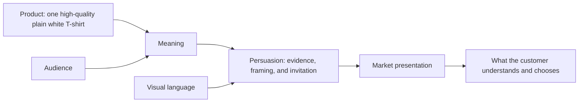

# Chapter 4: One White T-Shirt, Four Different Worlds

Here is the experiment: take one ordinary, high-quality plain white T-shirt. It has a comfortable fit, solid stitching, durable fabric, and ordinary care requirements. It has no secret performance technology, celebrity endorsement, or magic powers.

Now watch what happens when design and persuasion give that same object four different worlds to live in.

This is not a lesson in disguising a product. The shirt must remain substantially the same, and every practical claim must remain true. The lesson is that products carry more than utility. People also choose meanings: independence, creative possibility, calm competence, or belonging. The job of a responsible designer is to make the meaning coherent without using it to deceive.

## The shared product, before the stories begin

All four concepts use this same baseline product:

- Plain white T-shirt
- Comfortable everyday fit
- Durable fabric and solid stitching
- Standard machine-wash care
- No unverified sustainability, medical, athletic-performance, scarcity, or luxury claims

Those boundaries are useful. They prevent the branding exercise from turning into fiction. A concept can change the *experience of meaning*; it cannot honestly invent a feature the shirt lacks.

## Concept 1: The Detour Tee

**Audience:** Students and early-career adults who enjoy day trips, wandering unfamiliar neighborhoods, and leaving room in their schedule for something unexpected.

**Chosen brand archetype:** Explorer.

**Persuasion principles being used:** Commitment and consistency (connect it to a person’s wish to be more open and self-directed); liking (friendly, recognizable scenes of small adventures); social proof, but only through genuine customer stories if any are used.

**Visual-design language:** Sun-faded colors, practical type, annotated maps, candid movement, and a little visual wear. The system is loose but legible: a field notebook, not a survival catalog.

**Headline:** “Take the long way home.”

**Short product story:** This is the shirt you pull on when the plan is “coffee, maybe.” It is a reliable white layer for a train ride, a borrowed bike, a bookstore you did not expect, and the walk home after your phone runs low. It will not make you adventurous. It simply gets out of the way while you practice being curious.

**Imagery direction:** A person crossing a street with a folded city map; a white shirt in ordinary daylight, slightly rumpled after a day out; details such as a ticket stub or a notebook. Avoid staged summit poses or images that imply technical outdoor performance.

**What meaning the customer is actually being invited to buy:** “I am the kind of person who notices possibilities and does not need every hour planned.”

**Ethical concern or possible misuse:** The Explorer story can romanticize mobility, leisure, and risk as if everyone has equal access to them. It can also become false performance branding if a basic T-shirt is made to sound like specialist gear. Keep the claims ordinary, and avoid treating constrained lives as a failure of adventurous spirit.

## Concept 2: The Standard Issue

**Audience:** People building a small, reliable wardrobe and students who want fewer decisions before an early class or work shift.

**Chosen brand archetype:** Ruler, supported by Sage.

**Persuasion principles being used:** Authority through specific, relevant product information; commitment and consistency for people pursuing a simpler routine; cognitive ease through a clear choice architecture. There is no fake scarcity and no vague “expert approved” seal.

**Visual-design language:** Restrained modernist / Swiss-influenced design. A precise grid, black sans-serif type, white space, a single frontal photograph, measured rules, and a factual hierarchy. The page should feel as if it has already made the room tidy.

**Headline:** “A white T-shirt. Precisely enough.”

**Short product story:** One dependable shirt, described without theatre. Here is the fit. Here is the fabric. Here is how to wash it. Here are the sizes. It is for people who would rather spend their attention on the rest of the day.

**Imagery direction:** Front, side, and close-up views on a neutral background; clear size-reference images; a small construction detail. Photography is even and unglamorous enough to support comparison. Let the information do some of the visual work.

**What meaning the customer is actually being invited to buy:** “I am composed. I choose useful things deliberately. My basics are handled.”

**Ethical concern or possible misuse:** Minimalism can disguise missing information or make an ordinary item seem more prestigious than it is. The word “precise” should be supported by visible sizing, care, and material details. A supposedly neutral design can also exclude people if it assumes one body, one wardrobe, or one idea of professionalism.

## Concept 3: The Blank Has Opinions

**Audience:** Art, design, and music students who treat clothes as a surface for experimentation and enjoy visual humor.

**Chosen brand archetype:** Creator, supported by Jester.

**Persuasion principles being used:** Liking through a lively creative community; unity through genuine shared making; reciprocity through a useful, optional guide to decorating and caring for the shirt. The invitation is to participate, not to purchase membership in a fake scene.

**Visual-design language:** Disruptive postmodern language. Oversized type collides with small footnotes. A grid appears, then gets interrupted by doodles, tape textures, color clashes, and intentionally awkward crop marks. Important details still have one calm, readable home.

**Headline:** “This shirt has nothing to say. Fix that.”

**Short product story:** The shirt arrives plain because the first move is yours. Write on it, print on it, wear it spotless, turn it inside out, or use it as the quiet part of an otherwise noisy outfit. The object is ordinary on purpose; your use is what makes it interesting.

**Imagery direction:** Photocopied sketches, paint tests, patches, screen-print screens, and several people styling the same white shirt in incompatible ways. Show both successful experiments and a few charmingly imperfect ones. Include a clear fabric close-up and care information away from the visual chaos.

**What meaning the customer is actually being invited to buy:** “I do not need a finished identity handed to me. I can make, remix, and laugh at the rules.”

**Ethical concern or possible misuse:** “Be original” can become pressure, especially when the campaign quietly defines which kind of originality looks cool. The chaotic aesthetic can also bury pricing, sizing, care, or accessibility information. Do not use a rebellious voice to hide conventional sales pressure.

## Concept 4: The Shared Shift Tee

**Audience:** People who want a comfortable, unpretentious everyday shirt and value feeling at ease with friends, classmates, coworkers, or neighbors.

**Chosen brand archetype:** Everyperson, supported by Caregiver.

**Persuasion principles being used:** Social proof through verified, representative reviews where available; unity through shared routines; reciprocity through genuinely helpful fit and exchange guidance. The message avoids telling buyers that belonging depends on owning the shirt.

**Visual-design language:** Warm documentary photography, plainspoken type, practical color accents, and layouts that feel conversational rather than polished to a shine. The interface uses a dependable grid, but the images bring in lived texture.

**Headline:** “The one you reach for.”

**Short product story:** It is laundry day. You have twenty minutes. Someone texts that they are downstairs. This is a clean, comfortable shirt that works with what you already own. No costume, no reinvention, no speech required.

**Imagery direction:** A group cooking, waiting for a bus, moving into a dorm, or sitting around a table. Show different bodies and ways of styling the shirt. Keep the situations ordinary; the point is recognition, not aspirational perfection.

**What meaning the customer is actually being invited to buy:** “I belong in everyday life. I do not have to perform to be welcome.”

**Ethical concern or possible misuse:** Images of community can become tokenism if people are selected only to signal diversity. “For everyone” can also hide limited sizing, inaccessible purchasing, or an unaffordable price. Belonging has to be supported by the actual experience.

## What changes—and what does not

| Concept | Archetype | Audience promise | Persuasion emphasis | Visual language | Meaning invited | Main ethical watch-out |
| --- | --- | --- | --- | --- | --- | --- |
| The Detour Tee | Explorer | A dependable layer for unplanned days | Commitment, liking, genuine social proof | Field notes, movement, sun-faded practicality | “I am curious and self-directed.” | Do not romanticize privilege or imply technical performance. |
| The Standard Issue | Ruler + Sage | Fewer wardrobe decisions, clearly explained | Relevant authority, consistency, cognitive ease | Restrained Swiss-influenced grid and factual hierarchy | “I am composed and deliberate.” | Do not use minimalism to imply luxury or hide exclusions. |
| The Blank Has Opinions | Creator + Jester | A base for personal experimentation | Liking, unity, useful reciprocity | Disruptive postmodern collage and anti-grid moments | “I can make and remix.” | Do not turn originality into pressure or bury vital details. |
| The Shared Shift Tee | Everyperson + Caregiver | Comfortable participation in ordinary life | Genuine social proof, unity, helpful reciprocity | Warm documentary realism with usable structure | “I belong without performing.” | Do not make belonging a costume or an empty diversity claim. |

The four presentations do not create four fabrics. They create four different sets of attention, expectation, and self-story. A shopper may prefer one because it matches a real need; another may reject it because the proposed identity feels foreign. That is normal. Good positioning is not universal hypnosis.

## What this case study teaches

The T-shirt becomes more interesting when you stop asking only, “How do we sell it?” Ask instead:

- What human situation is this product honestly useful for?
- What feeling or possible self does the presentation make available?
- What evidence supports that promise?
- Does the visual language make the meaning clearer or merely louder?
- Could someone make a free, informed choice after seeing this presentation?

The most entertaining concept is not necessarily the most persuasive for every audience. The most restrained layout is not necessarily more honest. The strongest presentation is the one whose product, audience, meaning, persuasion, and visual language agree with one another—and whose ethical limits are taken seriously.

## What You Should Remember

One high-quality plain white T-shirt can become an Explorer’s companion, a modernist essential, a postmodern creative prompt, or an everyday signal of belonging without changing its physical basics. Positioning combines a real product with a particular audience, meaning, persuasion strategy, and visual language. Make that combination coherent, concrete, and truthful; the story should enrich a product rather than invent a different one.
