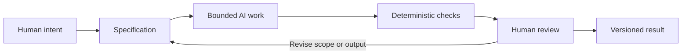

# Chapter 5: Directing the Work, Not Just the Output

The earlier chapters introduced three ways to think about creative work:

- **Persuasion** asks: *What response are we trying to enable?*
- **Archetype** asks: *What meaning or identity are we expressing?*
- **Design language** asks: *How should that meaning look and feel?*

Together, they form a high-level control framework. They help a team move from “make something good” to a clearer direction: help first-year students feel capable enough to begin; express a Sage-like promise of clarity with a Creator-like invitation to experiment; use a calm, legible visual system with room for lively examples.

This framework is useful when people make work by hand. It becomes especially useful when people direct AI-assisted creative and technical work, because an AI system can produce many plausible outputs very quickly. Speed makes direction more important, not less.

## From intention to a useful AI task

Imagine asking an AI to create a landing page for the plain white T-shirt. “Make a cool page” leaves almost everything unresolved. Cool for whom? What should they understand? Is the shirt an Explorer’s companion, a Creator’s blank canvas, or a restrained everyday basic? Which facts must be true? What must not happen?

The three-part framework turns a vague request into a working brief:

| Framework lens | Decision | Example direction for the T-shirt page |
| --- | --- | --- |
| Persuasion | What response should the work enable? | Help shoppers compare fit, fabric, care, and price, then decide without pressure. |
| Archetype | What meaning or identity should it express? | Sage with a little Ruler: informed, composed, and deliberate. |
| Design language | How should the meaning look and feel? | Swiss-influenced grid, factual hierarchy, generous space, readable sans-serif type. |

That brief does not guarantee good work. It does make the work easier to evaluate. If the resulting page hides the care instructions behind a flashy animation, it fails the persuasion goal. If it uses loud collage and cryptic jokes, it may conflict with the chosen meaning and visual language. You can point to the mismatch instead of saying only, “It feels off.”

## Why AI work needs a specification

A **specification** is a clear boundary around a task: the goal, audience, requirements, constraints, inputs, expected output, and checks for success. It is not bureaucracy for its own sake. It gives an AI system a defined problem and gives humans a basis for deciding whether the result is acceptable.

For a technical task, a specification might say: “Add a size-chart component to the product page; use the existing component patterns; display the supplied measurements; do not alter checkout behavior; add or update the relevant tests.” For a creative task, it might say: “Write a 200-word product story for an Explorer audience; do not claim technical performance, scarcity, or environmental certifications; include a clear return-policy reference.”

Boundaries matter because AI can confidently fill gaps with assumptions. A good specification reduces the number of gaps it is allowed to fill. It also names non-goals: work that sounds adjacent but should remain untouched.

| A vague request | A bounded specification |
| --- | --- |
| “Make the shop better.” | “Improve the size-selection step for first-time shoppers. Preserve current prices and checkout flow. Make size guidance visible before purchase. Validate keyboard use and small-screen layout.” |
| “Write persuasive copy.” | “Write three honest 40-word headlines for the plain white T-shirt. Audience: students seeking an everyday basic. Avoid false urgency, performance claims, and unverified environmental language.” |
| “Clean up the code.” | “Refactor this named component to remove duplicated formatting logic. Keep its public behavior unchanged. Run the project’s specified formatting, type, and unit checks.” |

Specifications do not remove judgment. They make judgment more focused.

## A delivery path with human control

The arrows describe a working loop, not a ceremony that happens once. Human review may discover that the specification was unclear, the intended meaning does not fit the audience, or a previously unnoticed constraint matters. Revising the brief is progress when it makes the work truer.

## Git: a memory for change

Git is a version-control system. In practical terms, it records a history of changes to files. That history provides **traceability**: a team can see what changed, compare versions, connect a change to a task or decision, and discuss a specific diff rather than a foggy memory of “the version from yesterday.”

It also provides **recovery**. When an experiment goes wrong, a prior known-good version can be inspected or restored through an appropriate workflow. This does not mean every change is automatically safe, and it does not excuse careless work. It means experimentation need not be irreversible.

For AI-assisted work, Git helps answer useful questions:

- What did the AI-generated change actually modify?
- Which human reviewed or approved this version?
- Did a later change introduce the problem?
- What did the project look like before this experiment?

Keep commits small and meaningful when possible. A commit called “Add accessible size chart and tests” is easier to inspect than a giant mixture of unrelated copy edits, dependency updates, and layout changes. Traceability improves technical maintenance and also supports truthful accountability.

## Deterministic checks: cheap, repeatable evidence

Some questions have answers a computer can check consistently. A formatter can verify formatting rules. A type checker can detect certain type mismatches. Unit tests can check expected behavior. A build can reveal whether an application compiles. Link checks, linting, and accessibility checks can catch particular classes of problems.

These are **deterministic automated checks** when the same inputs and environment produce the same pass-or-fail result. They are valuable because they are cheap to repeat after every small change. Let automation do the routine inspection it can do reliably.

But a green check is evidence, not a certificate of overall quality. Tests only cover what someone specified. A page can pass every test and still be confusing, inaccessible in a real context, factually misleading, culturally tone-deaf, or misaligned with the product’s purpose.

## AI review: useful, fast, and probabilistic

An AI reviewer can be useful as another set of eyes. It can summarize a change, compare it against a stated specification, suggest missing tests, flag possible edge cases, find inconsistent language, or draft review questions. This can reduce the cost of routine review and help a student learn what to look for.

Its judgment is **probabilistic**, however. It may notice a real issue, miss an important one, misunderstand the codebase, invent a concern, or state an uncertain conclusion with confidence. Different prompts or runs may produce different reviews. Treat AI review as a lead to investigate, not as final proof that work is correct or safe.

This is especially important for claims, people, and context. An AI can make a sentence sound persuasive or an interface look polished without knowing whether a product claim is true, whether imagery is appropriate, or whether a proposed interaction harms someone. Those are not merely formatting problems.

## Human review is the pit stop

A race car can keep moving at high speed, but a pit stop creates a selected moment for deliberate inspection: check the tires, look for damage, make a planned adjustment, and decide whether the car should return to the track. The goal is not to stop the race after every lap. It is to pause where inspection has high value.

AI-assisted workflows need the same idea. Automation can keep running: formatting files, executing tests, checking types, producing drafts, and suggesting changes. At selected moments—before merging a sensitive feature, publishing product claims, changing payments or permissions, releasing a public page, or accepting a large AI-generated patch—a human should slow down and inspect deliberately.

Human review asks questions automation cannot settle on its own:

- Is this true, and can we support the claim?
- Does this serve the intended audience rather than merely optimize a metric?
- Does the archetype or visual language communicate the intended meaning in this context?
- Is the design understandable, accessible, and respectful in actual use?
- Does the change belong in this project, and are we willing to own its consequences?

The human is not a ceremonial rubber stamp at the end. Humans set the intent, write and revise the boundaries, interpret evidence, make trade-offs, and take responsibility for the final decision.

## A practical control loop

When you direct AI work, try this compact loop:

1. State the audience, response, meaning, and desired design language.
2. Write a bounded specification with facts, constraints, non-goals, and acceptance checks.
3. Ask the AI to work only within that scope.
4. Run deterministic checks early and again after changes.
5. Use AI review to generate questions or spot candidates for inspection.
6. Conduct a deliberate human pit stop at the right level of risk.
7. Record the accepted work in version control so the decision and result can be traced.

For the white T-shirt, this might mean: a team wants shoppers to make a calm, informed choice; selects Sage/Ruler meaning; chooses a Swiss-influenced product page; asks AI to implement a specified size-chart component; runs build, type, and interaction checks; then a human confirms that the facts are correct, the sizing is understandable, and the restrained presentation does not conceal important trade-offs.

## Questions for Next Week

1. Choose an everyday product. What response would you want its design to enable?
2. Which archetype could give that product a useful meaning, and which archetype would be misleading?
3. What visual language would make the meaning credible without sacrificing clarity?
4. Write a five-sentence specification for an AI-assisted change to that product’s website or packaging.
5. Which checks could be deterministic, and which questions require human judgment?
6. Where would you schedule a pit stop before releasing the work?

## What You Should Remember

Persuasion defines the response to enable, archetype defines the meaning or identity to express, and design language defines how that meaning looks and feels. In AI-assisted work, turn those decisions into a bounded specification; use Git for traceability and recovery; rely on deterministic checks for repeatable evidence; and treat AI review as helpful but probabilistic. Automation can keep running, but humans remain responsible for truth, context, judgment, and the final version they choose to release.
